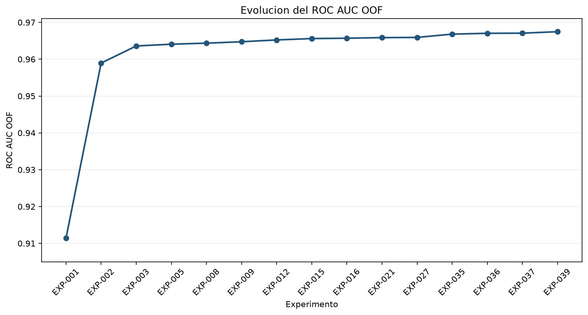
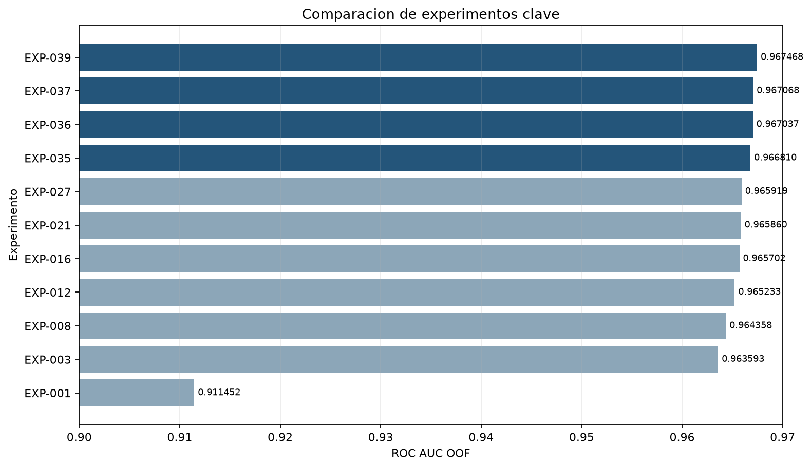

# Resultados

## Experimentos clave

| EXP | Modelo o cambio | OOF ROC AUC | Public LB | Evidencia del LB |
|---|---|---:|---:|---|
| EXP-001 | Logistic baseline | 0.911452 | 0.91355 | exacta local |
| EXP-003 | CatBoost 4.000 iteraciones | 0.963593 | 0.96497 | exacta local |
| EXP-004 | LightGBM baseline | 0.963537 | 0.96515 | exacta local |
| EXP-008 | XGBoost baseline | 0.964358 | 0.96587 | exacta local |
| EXP-012 | XGBoost + thresholds | 0.96523300 | 0.96696 | exacta local |
| EXP-016 | XGBoost depth 5 | 0.96570217 | 0.96730 | exacta local |
| EXP-021 | Rank ensemble | 0.9658597975 | 0.96733 | exacta local |
| EXP-027 | Bag de seeds + CatBoost | 0.9659191881 | — | — |
| EXP-035 | Exact-value Logistic + blend | 0.9668097849 | 0.96815 | reportada |
| EXP-036 | Ratios + blend | 0.9670368278 | 0.96838 | reportada |
| EXP-037 | Relaciones + blend | 0.9670683293 | 0.96842 | reportada |
| EXP-039 | Ensemble final | **0.9674680608** | **0.96876** | reportada |

La tabla completa está en [`outputs/metrics/experiment_log_v2.csv`](../outputs/metrics/experiment_log_v2.csv). Los Public LB marcados como reportados fueron suministrados durante la preservación, pero no tienen un artifact local descargado de Kaggle.

## Evolución

El salto principal ocurrió entre la Logistic inicial y los modelos de boosting. Después, las mejoras fueron acumulativas:

1. XGBoost estableció una referencia de `0.964358`.
2. Threshold features llevaron la rama a `0.965233`.
3. El refinamiento de EXP-016 llegó a `0.96570217`.
4. Estabilizar seeds y sumar diversidad produjo `0.9659191881`.
5. La Logistic sparse exact-value y sus relaciones cruzaron `0.967`.
6. LightGBM high-resolution añadió la última señal complementaria y el ensemble terminó en `0.9674680608`.

Los datos usados en los gráficos están en [`key_experiments.csv`](../outputs/reports/key_experiments.csv) y [`score_progression.csv`](../outputs/reports/score_progression.csv).

## Ensemble final

| Componente | Peso | Papel |
|---|---:|---|
| EXP-027 | 0.375 | XGBoost estabilizado por seeds y CatBoost |
| EXP-037 | 0.225 | Logistic sparse con relaciones |
| EXP-039 | 0.400 | LightGBM high-resolution |

El blend se hace sobre rankings normalizados. Su paridad fue validada contra los artifacts persistidos: el AUC reconstruido difiere `1.01e-11` del valor histórico por serialización de floats, y la submission temporal difiere como máximo `1.11e-16` sin alterar IDs ni orden.

## OOF frente a leaderboard

OOF y Public LB se movieron de forma similar, pero no son intercambiables. Las decisiones del proyecto se tomaron con CV; el leaderboard se usó para comprobar generalización. Esta separación evita ajustar pesos o features a una fracción del test.

**Private LB:** no disponible al momento del cierre de esta documentación.
